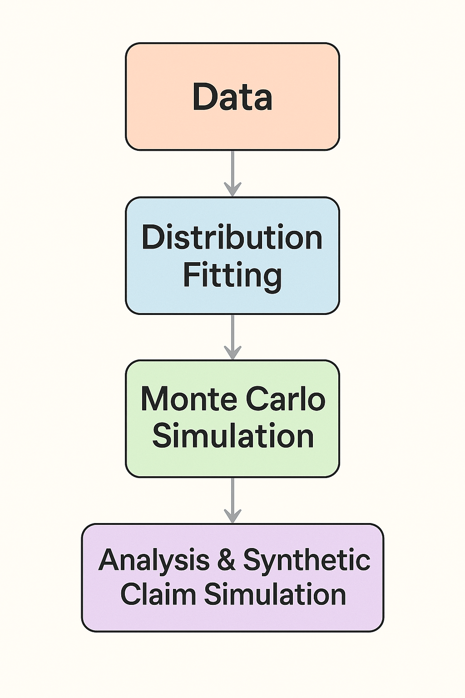

# ActSim User Manual


ActSim is a Python package for actuarial risk modelling and simulation. It provides tools for fitting probability distributions to insurance‐related data, running high‑performance Monte‑Carlo simulations with flexible dependency structures, generating synthetic claims, and analysing results. The package supports YAML‑based configuration files, enabling users to customise the distributions and metrics used for fitting and simulations.


## 1. Features


ActSim focuses on actuarial risk analytics. Its main features include:


- **Risk modelling** – tools to fit severity and frequency distributions to empirical data and evaluate goodness‑of‑fit metrics.
- **Monte‑Carlo simulations** – high‑performance simulation engine for aggregate loss modelling and multivariate simulations, with support for copulas and linear correlation.
- **Configuration management** – YAML configuration files specify which distributions and metrics are available. Users can load the default configuration or supply their own.
- **Statistical analysis** – functions to summarise fitting results, calculate statistics (e.g., AIC, BIC, VaR/TVaR, exceedance probabilities), and plot fitted distributions.
- **Synthetic claim simulation** – generate claim counts and severities per policy, simulate occurrence dates using non‑homogeneous Poisson processes, and generate claim development data based on specified LDFs.


## 2. Installation


The package is compatible with Python 3.8 or later. Install via pip or from source:


### 2.1. Install from PyPI (recommended)


```bash
pip install ActSim
```


### 2.2. Install from source


```bash
git clone https://github.com/jzhng105/ActSim.git
cd ActSim
pip install -e .
```


### 2.3. Development installation


If you intend to contribute to the project, install the development dependencies:


```bash
git clone https://github.com/jzhng105/ActSim.git
cd ActSim
pip install -e .[dev]
```


Dependencies include NumPy, SciPy, pandas, matplotlib, seaborn, statsmodels, and `actstats/actrisk`. Make sure these packages are installed when building from source.


## 3. Configuration management


ActSim uses a YAML configuration file to define which severity and frequency distributions and which goodness‑of‑fit metrics are available. The default configuration contains lists of distributions such as `normal`, `lognormal`, `gamma`, `poisson` and a set of metrics (`aic`, `bic`, `log_likelihood` and `chisquare`).


### 3.1. Loading the configuration


The package exposes a `load_config()` function. It reads `config.yaml` from the installed package and returns a `Config` object:


```python
from actsim import load_config, DistributionFitter


# load default config
auto_config = load_config()


# access lists from config
auto_config.distributions['severity']
auto_config.distributions['frequency']
auto_config.metrics
```


You can also create a `Config` object directly and optionally point to a custom YAML file:


```python
from actsim.utils import Config


# use default config
config = Config()


# or specify your own file
config = Config('path/to/custom_config.yaml')
```


The `Config` object provides methods to check keys, update values, reload from disk and access values as attributes. For example:


- `config.has_key('distributions')` – check if a section exists.
- `config.update({'new_metric':'ks_test'})` – merge new settings into the config.
- `config.reload()` – reload the YAML file from disk.


### 3.2. Customising distributions and metrics


To tailor the fitting process to your data, create a YAML file such as:


```yaml
distributions:
severity:
- normal
- lognormal
- gamma
frequency:
- poisson


metrics:
- aic
- bic
```


Then load the configuration using `load_config('custom_config.yaml')`. Only the distributions and metrics listed will be used in subsequent fitting operations.


## 4. Distribution fitting (`DistributionFitter`)


The `DistributionFitter` class fits a list of candidate distributions to sample data and calculates goodness‑of‑fit metrics. It uses the distribution implementations from the `actstats` package.


### 4.1. Initialising the fitter


```python
from actsim import load_config, DistributionFitter
import numpy as np


# generate example severity data
sev_data = np.random.lognormal(0.5, 0.2, size=10000)


# load config and get candidate distributions & metrics
config = load_config()
severity_dists = config.distributions['severity']
metrics = config.metrics


# create a fitter
ef = DistributionFitter(sev_data, distributions=severity_dists, metrics=metrics)
```


If you omit `distributions` or `metrics`, all supported distributions and the default metrics (`aic`, `bic`) will be used.


### 4.2. Fitting and selecting a distribution


Call `fit()` to estimate parameters for each candidate distribution. The fitter computes the log‑likelihood, AIC, BIC, chi‑square statistic and Kolmogorov–Smirnov statistic for each fitted distribution. After fitting, the `best_fits` dictionary holds the best distribution under each metric, and `selected_fit` holds the best fit under the first metric (AIC by default).


```python
ef.fit()
print(ef.best_fits['aic']) # distribution with lowest AIC
print(ef.selected_fit) # currently selected distribution
```


To select a different distribution manually, use `select_distribution('distribution_name')`. You can then access the selected distribution or its parameters with `get_selected_dist()` and `get_selected_params()`.


### 4.3. Predictions, sampling and statistics


- **Prediction:** `predict(x)` evaluates the probability density (or mass) of the selected distribution at the points `x`.
- **Sampling:** `sample(size)` draws random samples from the selected distribution. `sample_mixed(zero_prop, one_prop, size)` inserts a proportion of zeros and ones in the sample (useful for datasets with mass at zero or one).
- **Statistics:** `calculate_statistics()` returns a DataFrame containing mean, standard deviation and key percentiles of both the raw data and the fitted distribution.


### 4.4. Visualising results


Use `plot_predictions()` to draw a histogram of the data overlaid with the probability density functions of the fitted distributions along with the PDF curves of all the selected distributions. Finally, `summary()` returns a DataFrame summarising each fitted distribution, its parameters and metrics.


## 5. Stochastic simulation (`StochasticSimulator`)


`StochasticSimulator` generates aggregate loss simulations under specified frequency and severity distributions. It supports independent simulations, linear correlation or copula‑based dependencies.


### 5.1. Creating a simulator


```python
from actsim import StochasticSimulator


freq_dist = 'poisson' # name of frequency distribution
freq_param = (10,) # distribution parameters (e.g. λ=10)
sev_dist = 'lognormal' # name of severity distribution
sev_param = (10, 0.5) # distribution parameters (μ=10, σ=0.5)


# 10,000 simulations, keep all individual claims, random seed 1234,
# linear correlation 0.6, copula type 'frank' with parameter 0.6
sim = StochasticSimulator(freq_dist, freq_param,
sev_dist, sev_param,
num_sim=10000,
keep_all=True,
seed=1234,
correlation=0.6,
copula_type='frank',
theta=0.6)
```


The arguments are:


| Argument | Purpose |
|---|---|
| `freq_dist` | string naming the frequency distribution (e.g. `poisson`, `negative binomial`) |
| `freq_params` | tuple of parameters passed to the distribution |
| `sev_dist` | string naming the severity distribution (e.g. `lognormal`, `gamma`) |
| `sev_params` | tuple of parameters for severity distribution |
| `num_sim` | number of simulation years/observations (default 10 000) |
| `keep_all` | if `True`, stores individual event data for further analysis (e.g. OEP) |
| `seed` | random seed for reproducibility |
| `correlation` | optional linear correlation coefficient between frequency and severity |
| `copula_type` | optional copula (`gaussian`, `frank`, `gumbel`, `clayton`) used to model dependence |
| `theta` | parameter for the chosen copula |


### 5.2. Running simulations


Call `gen_agg_simulations()` to run the aggregate loss simulation. The method loops through each simulation year, draws the number of events from the frequency distribution and draws severities from the severity distribution. If `keep_all` is `True`, it also records each event’s year, event ID and loss amount. The method returns a list of aggregate losses across all years and stores detailed data in the `_all_simulations_data` attribute.


### 5.3. Analysing results


- **Results series:** The `results` property returns aggregate losses as a Pandas Series.
- **Event‑level DataFrame:** The `all_simulations` property returns a DataFrame with detailed events (year, event id and loss).
- **Percentiles:** `calc_agg_percentile(pct)` returns the aggregate loss percentile specified (e.g., `pct=99.2` for the 99.2‑th percentile).
- **Distribution plot:** `plot_distribution(bins=None, log_option=False)` draws a histogram of simulated aggregate losses.
- **Correlation plot:** If `keep_all=True`, `plot_correlated_variables()` shows a scatter/kernel density plot of event frequency versus mean severity and displays the correlation coefficient.
- **Risk measures:** `analyze_results(quantiles=[…])` calculates Value‑at‑Risk, Tail‑Value‑at‑Risk, occurrence exceedance probability (OEP) and aggregate exceedance probability (AEP) at specified quantiles.


### 5.4. Applying deductibles and limits


To apply insurance contract terms to the simulated losses, call `apply_deductible_and_limit(per_occurrence_ded, per_occurrence_limit, agg_ded, agg_limit)`. The method adjusts each event’s loss by the per‑occurrence deductible and limit, then aggregates by year and applies annual deductible and limit. It returns a DataFrame with gross (capped and floored) losses per year.


### 5.5. Multivariate correlated simulation


Use `gen_multivariate_corr_simulations(corr_matrix_file, dist_list_file, gen_marginal=False)` to simulate correlated losses across multiple lines of business. The method reads a CSV correlation matrix and a JSON list of distributions, performs Cholesky factorisation and transforms correlated standard normals into the specified marginal distributions. When `gen_marginal=True`, the simulator stores the simulated losses for each line of business in `_all_simulations_data`.


## 6. Synthetic claim simulation (`ClaimSimulator`)


`ClaimSimulator` is a higher‑level tool for generating synthetic policy and claim data. It groups policies by frequency/severity distributions and parameters and uses `StochasticSimulator` internally to simulate claim counts and severities. It then assigns claim occurrence dates and generates claim development triangles.


### 6.1. Creating a claim simulator


Prepare a DataFrame with one row per policy and the following required columns: `policy_id`, `freq_dist`, `freq_params` (tuple), `sev_dist`, `sev_params` (tuple), `start_date` and `end_date`. For example:


```python
import pandas as pd
import numpy as np
from actsim import ClaimSimulator


policies = pd.DataFrame({
'policy_id': range(1, 101),
'freq_dist': 'poisson',
'freq_params': list(zip(np.random.uniform(0.6, 0.8, 100).round(2),)),
'sev_dist': 'lognormal',
'sev_params': list(zip(np.random.uniform(8, 12, 100).round(2),
np.random.uniform(0.3, 0.7, 100).round(2))),
'start_date': pd.Timestamp('2023-01-01'),
'end_date': pd.Timestamp('2023-12-31'),
})


claim_sim = ClaimSimulator(policies, random_seed=42)
```


Optional arguments include `correlation`, `copula_type` and `copula_param` to model dependencies across claims.


### 6.2. Simulating claims


Call `simulate_claims()` to simulate the claim counts and severities for each policy. The method groups policies with identical distribution specifications and runs a separate `StochasticSimulator` for each group. The simulated claims are combined into a single DataFrame with columns `year`, `event_id`, `yearly_event_id`, `amount` and `policy_id` and stored in `claim_data`.


### 6.3. Simulating claim dates


To assign occurrence dates, use `simulate_dates_nhpp(lambda0, alpha, phase, T)` which samples event times from a non‑homogeneous Poisson process with baseline intensity `lambda0`, seasonality amplitude `alpha`, phase shift `phase` and exposure period `T`. The function uses `actstats` to generate fractions of the exposure period and maps them to dates via `fraction_to_date_full`.


After generating fractions, call `apply_shifted_dates(start_year)` to shift the simulated dates into a calendar year (for example 2023). This method also renames columns so that the claim amounts are stored under `ultimate_loss`.


### 6.4. Simulating claim development


The method `simulate_claim_development(base_LDFs, volatility=0.1, cumulative_factor=1.0)` constructs claim development triangles by applying a set of loss development factors (LDFs) at various development months. A random normal multiplier with standard deviation `volatility` introduces stochastic variation around each LDF. The method computes cumulative development factors (CDFs) and splits the ultimate loss into incurred amounts at each development month. The resulting long‑format DataFrame contains accident year, incurred date, claim id, policy id, development month, incurred loss and development date.


To persist the simulated development data, call `save_claim_development(filepath)` and supply a CSV file path.


## 7. Examples


### 7.1. Fitting severity and frequency distributions


```python
# ---------------------------------------------
# Import required modules
# ---------------------------------------------
from actsim import load_config, DistributionFitter
from actstats import actuarial as act

# ---------------------------------------------
# 1. Generate Example Data
# ---------------------------------------------
# Severity data: Using lognormal distribution with mu=0.5 and sigma=0.2
sev_data = act.lognormal(0.5, 0.2).rvs(size=10000)

# Frequency data: Using Poisson distribution with λ=10
freq_data = act.poisson.rvs(10, 1000)

# ---------------------------------------------
# 2. Load Configuration
# ---------------------------------------------
# This loads distribution lists and metrics from the actrisk config file
config = load_config()

# ---------------------------------------------
# 3. Fit Severity Distributions
# ---------------------------------------------
# Get severity distributions and metrics from config
distribution_names = config.distributions['severity']
metrics = config.metrics

# Initialize severity fitter
sev_fitter = DistributionFitter(sev_data, distributions=distribution_names, metrics=metrics)

# Perform fitting
sev_fitter.fit()

# View best fits and selected distribution
print("Best fits:", sev_fitter.best_fits)
print("Selected fit:", sev_fitter.selected_fit)
print("Selected distribution object:", sev_fitter.get_selected_dist())

# Manually selecting a distribution (example: 'uniform')
sev_fitter.select_distribution('uniform')
selected_fit = sev_fitter.selected_fit

# Print details of the selected fit
print("Selected fitting distribution:", selected_fit['name'])
print("Parameters:", selected_fit['params'])
print("AIC:", selected_fit['aic'])
print("BIC:", selected_fit['bic'])

# Calculate statistics for severity
sev_fitter.calculate_statistics()

# Plot predictions
sev_fitter.plot_predictions()

# Print summary report
sev_fitter.summary()

# ---------------------------------------------
# 4. Generate Samples from Severity Fit
# ---------------------------------------------
samples = sev_fitter.sample(size=10)
print("Generated samples:", samples)

# Generate mixed samples (e.g., weighted combinations)
samples = sev_fitter.sample_mixed(0.1, 0.1, size=10)
print("Generated samples:", samples)

# ---------------------------------------------
# 5. Fit Frequency Distributions
# ---------------------------------------------
distribution_names = config.distributions['frequency']
metrics = config.metrics

# Initialize frequency fitter
freq_fitter = DistributionFitter(freq_data, distributions=distribution_names, metrics=metrics)

# Show available frequency distributions
print("Frequency distributions:", freq_fitter.distributions)

# Perform fitting
freq_fitter.fit()

# View best fits and summary
print("Frequency best fits:", freq_fitter.best_fits)
print("Frequency selected fit:", freq_fitter.selected_fit)
freq_fitter.summary()
```


### 7.2. Simulating aggregate losses


```python
# ---------------------------------------------
# 1. Import Required Modules
# ---------------------------------------------
from actsim import StochasticSimulator
from actstats import actuarial as act

# ---------------------------------------------
# 2. Define Frequency and Severity Distributions
# ---------------------------------------------
# Frequency distribution: Poisson with λ=10
freq_dist = 'poisson'
freq_params = (10,)

# Severity distribution: Lognormal with mu=10, sigma=0.5
sev_dist = 'lognormal'
sev_params = (10, 0.5)

# Preview quantile (e.g., 80th percentile of Poisson)
quantile_80 = act.poisson.ppf(0.8, 10)
print("80th percentile of Poisson(10):", quantile_80)

# ---------------------------------------------
# 3. Initialize Simulator with Different Levels of Complexity
# ---------------------------------------------
dist = act.lognormal
dist(*sev_params).np_rvs(size=10)

# With copula and correlation settings
simulator = StochasticSimulator(freq_dist, freq_params, sev_dist, sev_params, 10000, True, 1234, 0.6, 'frank', 0.6)

# Without specifying copula_type and theta (defaults apply)
simulator = StochasticSimulator(freq_dist, freq_params, sev_dist, sev_params, 10000, True, 1234, 0.6)

# Without using copula at all
simulator = StochasticSimulator(freq_dist, freq_params, sev_dist, sev_params, 10000, True, 1234)

# ---------------------------------------------
# 4. Generate Simulated Aggregate Losses
# ---------------------------------------------
simulations = simulator.gen_agg_simulations()

# Access full simulation DataFrame
print("All simulations preview:")
print(simulator.all_simulations.head())

# ---------------------------------------------
# 5. Analyze Simulation Results
# ---------------------------------------------

# Calculate aggregate percentile (e.g., 99.2%)
percentile_99_2 = simulator.calc_agg_percentile(99.2)
print("99.2% Aggregate Loss Percentile:", percentile_99_2)

# Plot loss distribution histogram
simulator.plot_distribution()

# Show simulation mean
print("Mean simulated loss:", simulator.results.mean())

# If copula is used, plot frequency-severity correlation structure
simulator.plot_correlated_variables()

# Summary statistics and shape diagnostics
simulator.analyze_results()

# ---------------------------------------------
# 6. Apply Deductibles and Limits
# ---------------------------------------------
# Apply per occurrence deductible of 1,000
# Occurrence limit of 10,000
# Annual aggregate deductible of 100,000
# Annual aggregate limit of 300,000
gross_loss = simulator.apply_deductible_and_limit(1000, 10000, 100000, 300000)


# Assign processed loss to expected structure for reporting
gross_loss['amount'] = gross_loss['gross_loss']

# Re-analyze results based on capped/layered gross loss
simulator.analyze_results(all_simulations=gross_loss)

# ---------------------------------------------
# 7. Export Simulated Data to CSV
# ---------------------------------------------
simulator.all_simulations
```


### 7.3. Synthetic claim simulation and development


```python
##########################################
###### Synthetic Claim Simulation ########
##########################################
import pandas as pd
import numpy as np
from actsim import ClaimSimulator 

# Simulate policy characteristics
policies = pd.DataFrame({
    'policy_id': range(1, 101),
    'freq_dist': 'poisson',
    'freq_params': list(zip(np.random.uniform(0.6, 0.8, 100).round(2),)), 
    'sev_dist': 'lognormal',
    'sev_params': list(zip(np.random.uniform(8, 12, 100).round(2), np.random.uniform(0.3, 0.7, 100).round(2))),
    'start_date': pd.Timestamp('2023-01-01'),
    'end_date': pd.Timestamp('2023-12-31'),
})

# Instantiate the ClaimSimulator with input policies and np random seed 42
claim_sim = ClaimSimulator(policies, 42)

# Access the processed policy DataFrame
claim_sim.policies

# Run the claim simulation (frequency × severity) for all policy groups
claim_sim.simulate_claims()

# Access the resulting simulated claim records
claim_sim.claim_data

# Set parameters for the non-homogeneous Poisson process (NHPP) for date simulation
lambda0 = 10     # Baseline intensity
alpha = 0.5      # Seasonality amplitude
phase = 0        # Phase shift of the seasonality
T = 1            # Duration of the exposure in years

# Simulate claim occurrence dates using a seasonal NHPP
claim_sim.simulate_dates_nhpp(lambda0, alpha, phase, T)

# Shift claim dates so that the simulation aligns with calendar year starting from 2023
start_year = 2023
claim_sim.apply_shifted_dates(start_year)

# Define base loss development factors (LDFs) by development month
base_LDFs = {
    0: 2,     # Initial LDF at 0 months
    3: 1.5,   # LDF at 3 months
    6: 1.2,
    9: 1.1,
    12: 1.05,
    15: 1.02,
    18: 1.00  # Ultimate LDF at 18 months
}

volatility = 0.1      # Standard deviation for stochastic fluctuation in LDFs
tail_factor = 1.0     # No additional tail development (fully developed at 18 months)

# Simulate the claim development triangles based on LDFs and apply stochastic volatility
claim_sim.simulate_claim_development(base_LDFs, volatility, tail_factor)

# Access the simulated claim development triangle or long-format development data
claim_sim.claim_development

# Access updated policies (could include mappings to simulated claims)
claim_sim.policies

# Save the simulated claim development data to a file (replace with actual path)
claim_sim.save_claim_development('sample_file_path')
```

### 7.4. Workflow summary diagram

The following diagram summarizes the typical workflow when using ActSim. It begins with data preparation, proceeds through distribution fitting and simulation, and ends with analysis and synthetic claim generation.



## 8. Additional resources


- **License:** ActSim is distributed under the Apache 2.0 licence. See `LICENSE` in the repository for details.
- **Issues & discussions:** Report problems or share ideas on the GitHub [issues](https://github.com/jzhng105/ActSim/issues) and [discussions](https://github.com/jzhng105/ActSim/discussions) pages.
- **Citation:** If you use ActSim in research, cite it as shown in the README:


```bibtex
@software{ActSim2025,
title = {ActSim: A ZNSTARS Python package for actuarial risk modeling and simulation},
author = {Juntao Zhang},
year = {2025},
url = {https://github.com/jzhng105/ActSim}
}
```


## 9. Development and contribution


To set up a development environment:


```bash
# Clone the repository and create a virtual environment
git clone https://github.com/jzhng105/ActSim.git
cd ActSim
python -m venv venv
source venv/bin/activate # use venv\Scripts\activate on Windows


# Install development dependencies
pip install -e .[dev]
```


The recommended workflow for contributors is to fork the repository, create a feature branch, commit changes with tests and open a pull request.


---

This manual summarises the main capabilities of ActSim and shows how to perform distribution fitting, aggregate simulations and synthetic claim modelling. Refer to the example scripts in the `examples/` directory for more complete demonstrations and adapt them to your own actuarial modelling tasks.